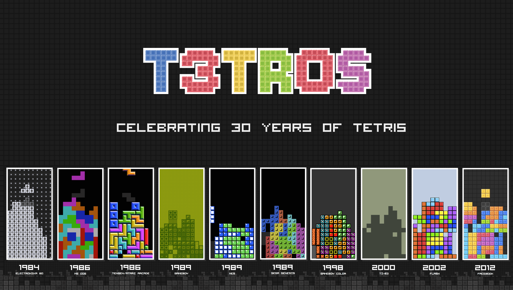

<a href="http://t3tr0s.com">

</a>

__[PLAY HERE](http://t3tr0s.com)__

We re-created Tetris™ in
[ClojureScript](https://github.com/shaunlebron/ClojureScript-Syntax-in-15-minutes).
We mainly did this to
[produce the pleasure](http://youtu.be/nTDRY8aPy7c?t=3m14s)
and to celebrate the 30th anniversary of its original release in 1984.  Our
remake enabled us to host a small, local tournament to share a montage
of the game's history.  Choose from 10 themes representing the popular versions
from its past.


## DevBlog

__In the beginning__, we worked on the game at least once a week.  It got
pretty crazy at the end closer to deadline, but our initial process is
documented in blogs below:

- [DevBlog 1](devblog/day01.md) - data, collision, rotation, drawing
- [DevBlog 2](devblog/day02.md) - basic piece control
- [DevBlog 3](devblog/day03.md) - gravity, stack, collapse, hard-drop
- [DevBlog 4](devblog/day04.md) - ghost piece, flash before collapse
- [DevBlog 5](devblog/day05.md) - game over animation, score
- [DevBlog 6](devblog/day06.md) - level speeds, fluid drop, improve collapse animation, etc.
- [DevBlog 7](devblog/day07.md) - draw next piece, tilemap for themes
- [DevBlog 8](devblog/day08.md) - allow connected tiles for richer graphics
- Day 9 - live board broadcasting (no blog)
- Day 10 - chat room, more tilemaps, page layouts (no blog)
- Day 11 - page routing, username (no blog)
- Day N - [socket netcode], spectate mode, MC controls, key-repeat control,
  chatroom, authentic theming, history graphs, ...

[socket netcode]:http://i.imgur.com/oG9hUpg.jpg

## Learn

__In the end__, we wrapped up what we learned into an educational resource:

- [Interactive Guide to Tetris in ClojureScript](https://github.com/shaunlebron/t3tr0s-slides) (below on the left)
- [A minimal version intended for readability](https://github.com/shaunlebron/t3tr0s-bare) (below on the right)

<a href="https://github.com/shaunlebron/t3tr0s-slides"></a><a href="https://github.com/shaunlebron/t3tr0s-bare"></a>

## Development Setup

1. Install [Leiningen] and [Node.js].
1. Run the following in the project directory

    ```sh
    # install node.js dependencies
    npm install
    
    # install grunt
    npm install -g grunt-cli

    # compile LESS file
    grunt

    # compile ClojureScript files (this may take a minute)
    lein cljsbuild once

    # copy the example config file (edit as needed)
    cp example.config.json config.json

    # start the node.js server
    node server.js
    ```

1. Open <http://localhost:1984> in your browser.

If you want a REPL connected to the browser for interactive testing:

```
lein repl
> (brepl)
```

## Team

- Elaine Looney - [@loonelainey](https://twitter.com/loonelainey), [github.com/imalooney](https://github.com/imalooney)
- Shaun Williams - [@shaunlebron](https://twitter.com/shaunlebron), [github.com/shaunlebron](https://github.com/shaunlebron), [shaunlebron.com](http://shaunlebron.com/)
- Luis Gutierrez - [@Dudemullet](https://twitter.com/Dudemullet), [github.com/dudemullet](https://github.com/dudemullet)
- Chris Oakman - [@4c4fc7](https://twitter.com/4c4fc7), [github.com/oakmac](https://github.com/oakmac)
- Brett Darnell - [@brettdarnell](https://twitter.com/brettdarnell), [darnology.com](http://www.darnology.com/)
- Phil Gambling - [@pmhg](https://twitter.com/pmhg), [github.com/pgambling](https://github.com/pgambling)

## License

All code licensed under the terms of the [MIT License](https://github.com/imalooney/t3tr0s/blob/master/LICENSE).

The image files of past versions of the games (ie: the tilemap files) belong to their respective copyright holders.

Tetris is a registered trademark of The Tetris Company.

[Node.js]:http://nodejs.org
[Leiningen]:http://leiningen.org
