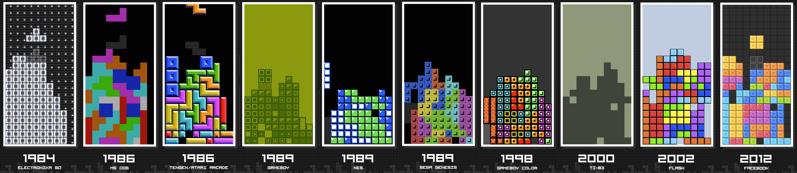
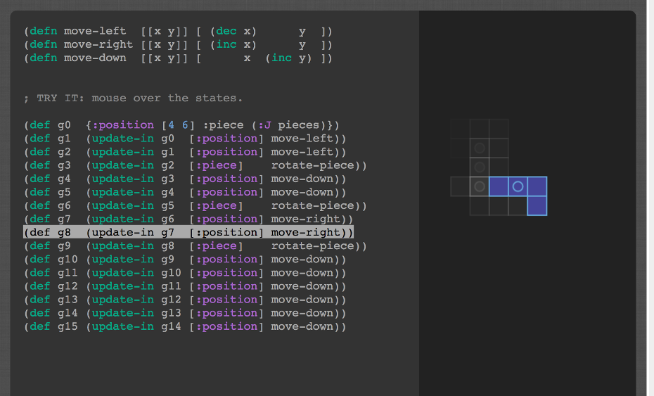
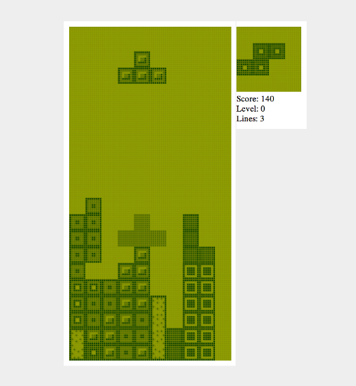

<a href="http://t3tr0s.com">



</a>

[Click to Play!](http://t3tr0s.com)

We re-created Tetris™ in
[ClojureScript](https://github.com/shaunlebron/ClojureScript-Syntax-in-15-minutes).
We mainly did this to
[produce the pleasure](http://youtu.be/nTDRY8aPy7c?t=3m14s)
and to celebrate the 30th anniversary of its original release in 1984.  Our
remake enabled us to host a small, local tournament to share a montage
of the game's history, with each level resembling a different version from its
past.

## Implementation

__In the beginning__, we worked on the game at least once a week.  It got p͏͌re̕tty
c͇̩ͨr᷊̎͘aͤͪ̏z̒̃̃y̬ͣ̆ at the end closer to deadline, but our initial process is documented
in blogs below:

- [DevBlog 1](devblog/day01.md) - data, collision, rotation, drawing
- [DevBlog 2](devblog/day02.md) - basic piece control
- [DevBlog 3](devblog/day03.md) - gravity, stack, collapse, hard-drop
- [DevBlog 4](devblog/day04.md) - ghost piece, flash before collapse
- [DevBlog 5](devblog/day05.md) - game over animation, score
- [DevBlog 6](devblog/day06.md) - level speeds, fluid drop, improve collapse animation, etc.
- [DevBlog 7](devblog/day07.md) - draw next piece, tilemap for themes
- [DevBlog 8](devblog/day08.md) - allow connected tiles for richer graphics
- Day 9 - live board broadcasting (no blog)
- Day 10 - chat room, more tilemaps, page layouts (no blog)
- Day 11 - page routing, username (no blog)
- Day N - socket netcode, socket rooms, page initialization/cleanup, dashboard
  broadcasting, MC screen, server game go-blocks, full-page gif recording, page
  re-entry and͞ redirection,̔ global piece stati᷊stics, spec̨tate board sw̠apping c͛ss ar̫tifacts, gravitÿ́ go-block bl̙unders, authentic d̛isplay ârtifact theming,
 ̷ ̙c̹ḩa̯t͆r͘o͗o̿m̋ ͎u͗s̬e᷇r̪ ̺l᷇i̩sͪt̝i͉n͍g͑,͟ ᷀p̲aͅu̗s̫e᷈ ̹s᷈c̸rͧe̦ēn̕ ̪a͌n̟i͘m͘a̙t̪îo̚n̑s͓,ͩ ̸m͡u̳s͕i͔c͑,ͫ ᷿ĥi̢s̀t̆o̘r᷇y̩ ͥs̙t͋a̹t᷆e᷀ ͮg͏r᷊a̚p̥h̪s̋,̲ ̖g͒âm̖e᷇p͙a̬d̰ ̈s̠u̒p̒p̜oͪr̼t̐,̝ ̢q͔ùǐcͅk̡-̨kͦe᷿y̤ ̓r̊e̯pͨe᷁a᷄t̫ ̈c̬u̘s̖t͑ȯm͌i̗z̫a͈t̿i͠o͕ṇ,ͨ ͆s̱pͦêc̣t̡a͋t͍e̚ ͊s̚c͛r̲eͩe͌ñ ͗u᷆s̫e̺r͖ ̝r᷈ēm͔ỏv͉a̻l̨
 ̘̓͜ ͎̈́᷀o̹̺͚n̯ͯ̏ ̴͌̔d̔̃͜i̴̩̅sͣ̊͊c̺̖̉o̥ͥ̐n̫͎᷀n͉ͨ᷈e̷̡͐c̴͔ͬt̝̒̀,̥͛᷉ ͐̎͂i̤̪᷈n̲ͨ̚ẗ́ͨ͊ḙ͛͂r͔̳᷆a̼͑͟c̘̓ͯt̷͖̪i̪͂̌v̗̂͒ë̓̒ ̶̣ͩp͕͍̋r͒᷈͠ě̮͕s̥̔ͯe̹᷇̾n̨͎͟t̓̅̈́ä̙́͂t̗͆̅i̸̮̓ơͯ͘n͚ͣ͟ş᷿᷇,̨̄᷉ ̼᷄̂e̫͆͟v͈͒̄e᷂ͮ᷃n̵̓ͬt̗̓̋-̛̆̆p̥ͩ͜l̸̷̈́a͓̬̅ņ̐͞n̜̒͠iͨ᷆̂n̴̮᷊ǵ̻̂ ͂͛᷈(̖͉ͬn᷃᷃̾o͈̒̋ ̸̼͜b̰̓̚l̠̀̓o̻̎̌g̭̥᷈)͔᷿͞

__In the end__, we wrapped up our work in the following forms:

- [Interactive Guide to Tetris in ClojureScript](https://github.com/shaunlebron/t3tr0s-slides) (below on the left)
- [A minimal version intended for readability](https://github.com/shaunlebron/t3tr0s-bare) (below on the right)

<a href="https://github.com/shaunlebron/t3tr0s-slides"></a><a href="https://github.com/shaunlebron/t3tr0s-bare"></a>

## Setup

1. Install [Leiningen] and [Node.js].
1. Run the following in the project directory

    ```sh
    # install node.js dependencies
    npm install

    # compile LESS file
    grunt

    # compile ClojureScript files (this may take a minute)
    lein cljsbuild once

    # copy the example config file (edit as needed)
    cp example.config.json config.json

    # start the node.js server
    node server.js
    ```

1. Open <http://localhost:1984> in your browser.

### Browser REPL

If you want a REPL connected to the browser for interactive testing:

```
lein repl
> (brepl)
```

### Recording GIFs

If you want to record a GIF of gameplay:

1. Create empty "gif" directory at the project root.
1. Play the game in the browser (with the developer console open).
1. Press "shift" to start/stop recording. (watch the console)
1. To write the recording to a file, type this in the browser REPL:

    ```clj
    (ns client.vcr)
    (publish-record!)
    ```

1. In the "gif" folder, you should see "anim.gif" and intermediate PNG frames.

## References

- <http://www.tetrisfriends.com/help/tips_appendix.php>
- <http://tetris.wikia.com/wiki/Tetris_Guideline>

## License

All code licensed under the terms of the [MIT License](https://github.com/imalooney/t3tr0s/blob/master/LICENSE).

The image files of past versions of the games (ie: the tilemap files) belong to their respective copyright holders.

Tetris is a registered trademark of The Tetris Company.

[Node.js]:http://nodejs.org
[Leiningen]:http://leiningen.org
