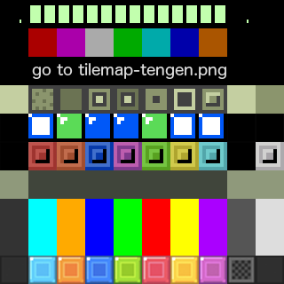

# Day 7


Made board renderer generic for different sizes and scales, so we can render
the "next piece" display as a small board and the competitor boards at smaller
scales.

```clj
(defn size-canvas!
  "Set the size of the canvas."
  ([id board scale] (size-canvas! id board scale 0))
  ([id board scale y-cutoff]
   (let [canvas (.getElementById js/document id)
         [w h] (board-size board)]
     (aset canvas "width" (* scale w))
     (aset canvas "height" (* scale (- h y-cutoff))))))

(defn draw-board!
  "Draw the given board to the canvas."
  ([id board scale level] (draw-board! id board scale level 0))
  ([id board scale level y-cutoff]
    (let [canvas (.getElementById js/document id)
          ctx (.getContext canvas "2d")
          [w h] (board-size board)]
      (doseq [x (range w) y (range h)]
        (let [color (cell-colors (read-board x y board))
              left (* scale x)
              top (* scale (- y y-cutoff))]
          (aset ctx "fillStyle" color)
          (.fillRect ctx left top scale scale)))
      nil)))
```

The actual board rendering lines are a bit long with addition of the new
parameters;  I wonder how I would make it cleaner.

```clj
; Set sizes
(size-canvas! "game-canvas" empty-board cell-size rows-cutoff)
(size-canvas! "next-canvas" (next-piece-board) cell-size)

; Draw boards
(draw-board! "game-canvas" new-board cell-size (:level @state) rows-cutoff)
(draw-board! "next-canvas" (next-piece-board next-piece) cell-size (:level @state))
```

The "next piece" board is just generated with a function:

```clj
(defn next-piece-board
  "Returns a small board for drawing the next piece."
  ([] (next-piece-board nil))
  ([piece]
    (let [board [[0 0 0 0]
                 [0 0 0 0]
                 [0 0 0 0]
                 [0 0 0 0]]]
      (if piece
        (write-piece-to-board piece 1 2 board)
        board))))
```

Created a simple tilemap, with the first three rows representing the original,
dos, and gameboy versions.  The rest of the rows just use our default colors:



The column order for the tiles are listed below in the `cell-columns` map.  And
draw-board is shown modified to read from the tilemap instead of drawing a
solid-filled rectangle.

```clj
(def tilemap (let [img (js/Image.)]
               (aset img "src" "tilemap.png")
               img))

(def cell-columns
  { 0 0
   :I 1
   :L 2
   :J 3
   :S 4
   :Z 5
   :O 6
   :T 7
   :G 8  ; ghost piece
   :H 9  ; highlighted (filled or about to collapse)
   })

(defn draw-board!
  "Draw the given board to the canvas."
  ([id board scale level] (draw-board! id board scale level 0))
  ([id board scale level y-cutoff]
    (let [canvas (.getElementById js/document id)
          ctx (.getContext canvas "2d")
          [w h] (board-size board)]
      (doseq [x (range w) y (range h)]
        (let [; tilemap position
              row (mod level 10)
              col (cell-columns (read-board x y board))

              ; source coordinates (on tilemap)
              sx (* scale col)
              sy (* scale row)
              sw scale
              sh scale

              ; destination coordinates (on canvas)
              dx (* scale x)
              dy  (* scale (- y y-cutoff))
              dw scale
              dh scale]

          (.drawImage ctx tilemap sx sy sw sh dx dy dw dh)))
      nil)))
```
