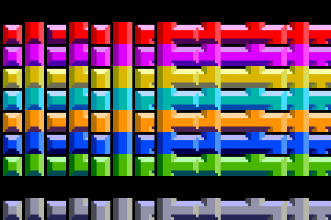

# Day 8

One of the most popular versions of Tetris was made by Tengen (Atari) for the
arcade, and later ported to the NES.  The tileset for this version is
elaborate, making each piece appear to be a contiguous form, rather than a
composition of separate squares.  Here is the entire tileset for the original
arcade release:



We only designed our game to handle drawing "isolated" cells, not the
"connected" cells that we see in the tilemap above.  It turns out that there is
a simple way to enable these richer tiles without too many changes to the code.

The key is to add an additional numeric component to our piece coordinates,
which we call our "adjacency" component.  Here is the documentation from the
code explaining how the new piece coordinates are represented.

```clj
; The available pieces resemble letters I,L,J,S,Z,O,T.
; Each piece structure is stored in :coords as [x y a].
; The "a" component of :coords stands for adjacency,
; which is a number with bit flags UP, RIGHT, DOWN, LEFT.

; For example, the coords for the J piece:
;
;       ********
;       * X=-1 *
;       * Y=-1 *
;       *      *
;       **********************
;       * X=-1 * X=0  * X=1  *
;       * Y=0  * Y=0  * Y=0  *
;       *      *      *      *
;       **********************
;
; We also need to encode "adjacency" information so we
; can graphically connect tiles of the same piece.
; These codes require explanation:
;
;       ********
;       *      *
;       * A=4  *
;       *      *
;       **********************
;       *      *      *      *
;       * A=3  * A=10 * A=8  *
;       *      *      *      *
;       **********************
;
; Adjacency codes are 4-bit numbers (for good reason),
; with each bit indicating adjacency along its respective direction:
;
;     UP  RIGHT  DOWN  LEFT -> binary -> CODE (decimal)
;     -     -     -     -      0000      0
;     X     -     -     -      0001      1
;     -     X     -     -      0010      2
;     X     X     -     -      0011      3  <-- shown in above example
;     -     -     X     -      0100      4  <-- shown in above example
;     X     -     X     -      0101      5
;     -     X     X     -      0110      6
;     X     X     X     -      0111      7
;     -     -     -     X      1000      8  <-- shown in above example
;     X     -     -     X      1001      9
;     -     X     -     X      1010      10 <-- shown in above example
;     X     X     -     X      1011      11
;     -     -     X     X      1100      12
;     X     -     X     X      1101      13
;     -     X     X     X      1110      14
;     X     X     X     X      1111      15 (not possible in tetris)
; 
; The revelation here is that SIMPLE ROTATION of the piece
; is achieved by applying this function over each coordinate:
;
;     Rotate( [X Y A] )  -->   [ -Y X (4 bit rotate of A) ]
; 
```

Using this information, we've redefined our pieces by adding an "adjacency"
number to each coordinate.  Also, we align the coordinate triples to resemble
the way they are laid out in space.

```clj
(def pieces
  {:I {:name :I
       :coords [
        [-1  0  2] [ 0  0 10] [ 1  0 10] [ 2  0  8]
        ]}

   :L {:name :L
       :coords [
                              [ 1 -1  4]
        [-1  0  2] [ 0  0 10] [ 1  0  9]
        ]}

   :J {:name :J
       :coords [
        [-1 -1  4]
        [-1  0  3] [ 0  0 10] [ 1  0  8]
        ]}

   :S {:name :S
       :coords [
                   [ 0 -1  6] [ 1 -1  8]
        [-1  0  2] [ 0  0  9]
        ]}

   :Z {:name :Z
       :coords [
        [-1 -1  2] [ 0 -1 12]
                   [ 0  0  3] [ 1  0  8]
        ]}

   :O {:name :O
       :coords [
                   [ 0 -1  6] [ 1 -1 12]
                   [ 0  0  3] [ 1  0  9]
        ]}

   :T {:name :T
       :coords [
                   [ 0 -1  4]
        [-1  0  2] [ 0  0 11] [ 1  0  8]
        ]}})
```

Rotating a piece is simply a matter of 4-bit rotation, which we add to the rotation function:

```clj
(defn rotate-piece
  "Create a new piece by rotating the given piece clockwise."
  [piece]
  (if (= :O (:name piece))
    piece
    (let [br (fn [a] (+ (* 2 (mod a 8)) (/ (bit-and a 8) 8)))
          new-coords (map (fn [[x y a]] [(- y) x (br a)]) (:coords piece))]
      (assoc piece :coords new-coords))))
```

When we write a piece to the board, the value is simply a string, combining the
piece name with the adjacency number.  Here are the functions for creating,
reading, and updating this special cell value.

```clj
(defn piece-value
  "Creates a cell value from the given piece type and adjacency."
  [t a]
  (if (zero? t) 0 (str (name t) a)))

(defn piece-type-adj
  "Gets the piece type and adjacency from a cell value string."
  [value]
  (let [t (if (zero? value) 0 (keyword (first value))) ; get the value key (piece type)
        a (if (zero? value) 0 (int (subs value 1)))]   ; get the adjacency code
    [t a]))

(defn update-adj
  "Updates the adjacency of the given cell value."
  [value f]
  (let [[t a] (piece-type-adj value)
        new-a (f a)]
    (piece-value t new-a)))
```

Drawing these cells is then a matter of choosing the correct tilemap and
position.  We only use the adjacency info attached to each cell if we are using
a tilemap that supports it.  Otherwise, we disregard it and use the simpler
"isolated" cells:

```clj
(def value-position
  "An ordering imposed on the possible cell types, used for tilemap position."
  { 0 0
   :I 1
   :L 2
   :J 3
   :S 4
   :Z 5
   :O 6
   :T 7
   :G 8  ; ghost piece
   :H 9  ; highlighted (filled or about to collapse)
   })

(defn get-image-region
  "Get the tilemap and position for the image of the given cell value and level."
  [level value]
  (let [wrap-level (mod level 10)]
    (if (= wrap-level 2)
      (let [[k a] (piece-type-adj value)
            row (value-position k)
            col a]
        [tilemap-tengen row col])
      (let [[k _] (piece-type-adj value)
            row wrap-level
            col (value-position k)]
        [tilemap row col]))))
```

And finally, when clearing a row, we remove the vertical adjacency of the neighboring
rows to ensure the remaining cells are not visually connected to destroyed cells.

```clj
(defn sever-row
  "Return a new row, severing its adjacency across the given boundary."
  [row dir]
  (let [adj (if (= dir :up) (+ 2 4 8) (+ 1 2 8))
        new-row (vec (map #(update-adj % (fn [a] (bit-and a adj))) row))]
    new-row))

(defn sever-row-neighbors
  "Return a new board, disconnecting the adjacency of the rows neighboring the given row index."
  [i board]
  (let [row-up (get board (dec i))
        board1 (if row-up
                 (assoc board (dec i) (sever-row row-up :down))
                 board)
        row-down (get board (inc i))
        board2 (if row-down
                 (assoc board1 (inc i) (sever-row row-down :up))
                 board1)]
    board2))
        
(defn clear-rows
  "Return a new board with the given row indices cleared."
  [rows board]
  (if (zero? (count rows))
    board
    (let [next-rows (rest rows)
          i (first rows)
          severed-board (sever-row-neighbors i board)
          next-board (assoc severed-board i empty-row)]
      (recur next-rows next-board))))
```
